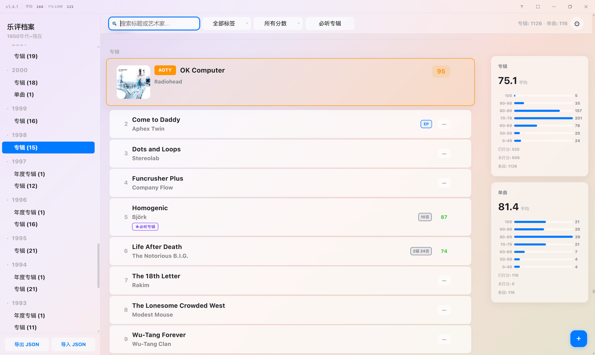
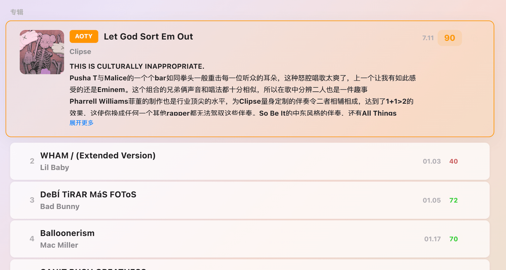
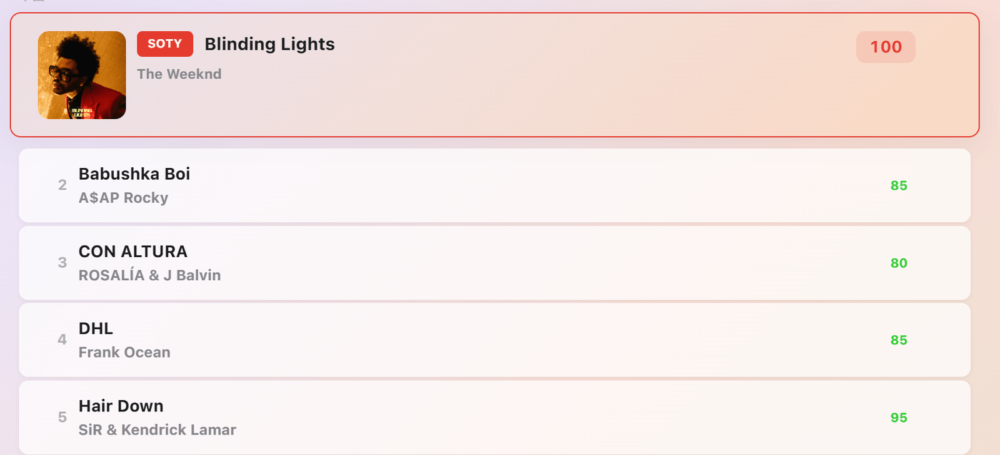
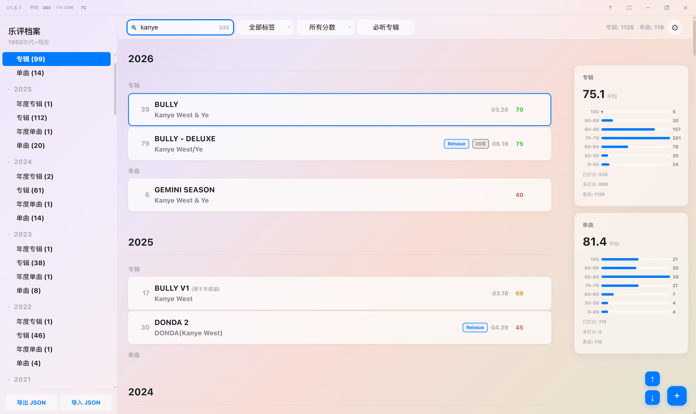
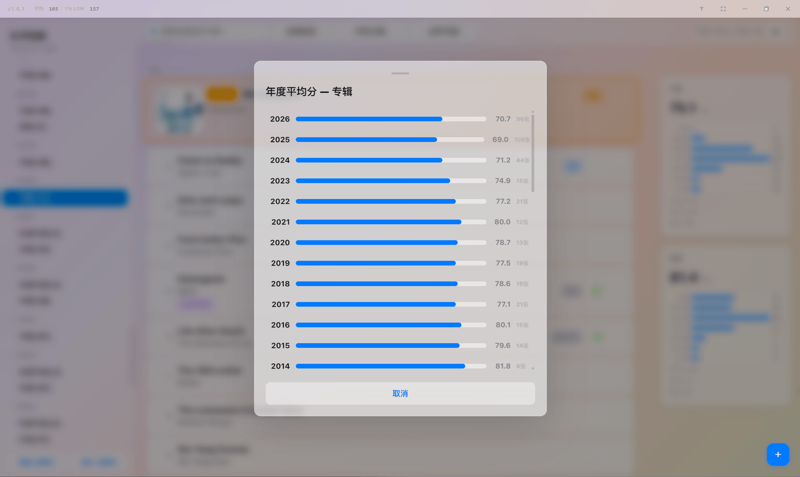
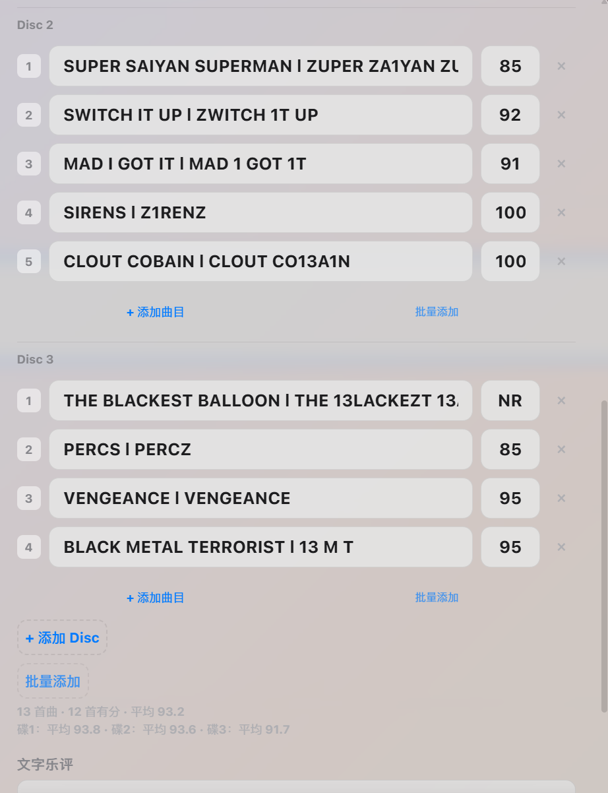
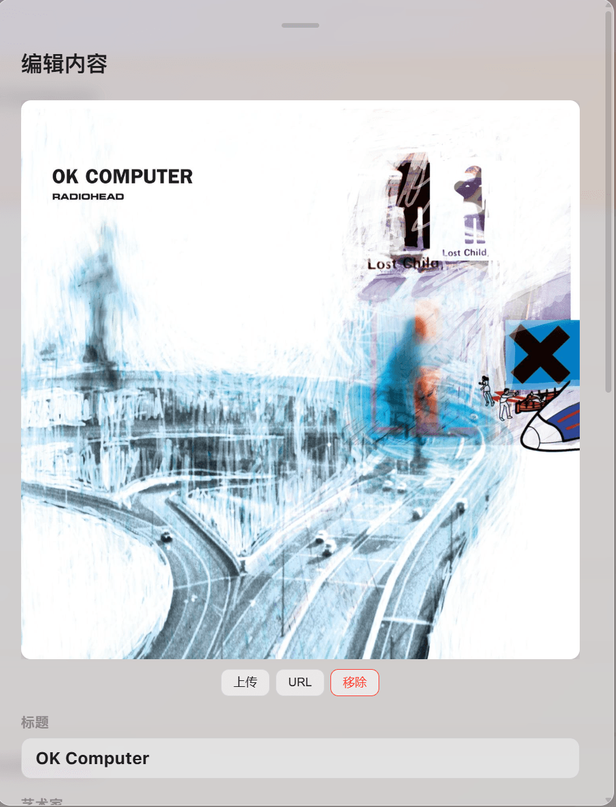
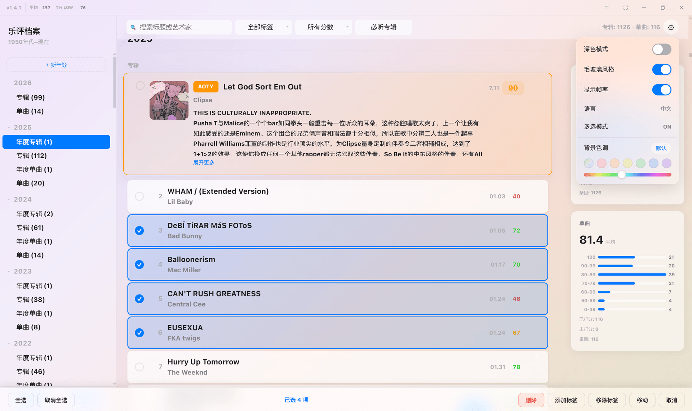
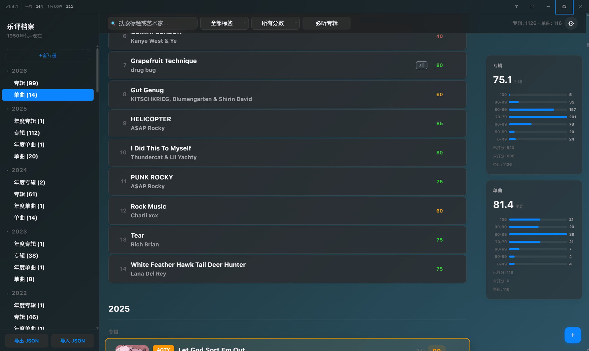
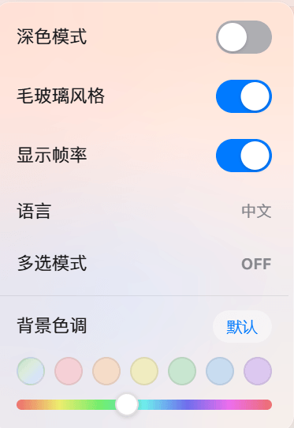

# Xan's Music Ratings Desktop

面向个人长期收藏的 Windows 音乐评分与乐评管理工具，基于 Tauri v2、Rust 和 WebView2。

它不是播放器，也不是在线社区，而是一张可以持续维护很多年的私人音乐档案：专辑、单曲、年度选择、曲目评分、封面和长评都保存在自己的电脑上。

<p align="center">
  <a href="docs/screenshots/overview.png">
    
  </a>
</p>
<p align="center"><sub>年代导航、AOTY、评分列表、分数分布与 FPS/1% Low 监视器</sub></p>

> 本仓库只维护桌面版，不提供网页版。`desktop-ui/` 是打包进 exe 的 WebView2 界面资源，不是独立网站。

## 下载

前往 [GitHub Releases](https://github.com/DEVILISALIE/Xan-s-Music-Ratings-Data/releases) 下载 Windows MSI 安装包。

当前版本：`v1.4.2`

## 把几十年的音乐放在一张时间轴上

左侧以年份和年代组织 Albums、Singles、AOTY 与 SOTY，主区域保留每个时期的上下文，右侧则持续显示专辑和单曲的整体评分分布。即使条目增长到上千条，也可以从侧边栏直接跳到指定分组，滚动时导航高亮会自动跟随。

不同年份使用不同的自动排序规则：较新的分区可以按日期组织，早期年代按年份倒序，年度最佳始终位于普通条目之前。普通卡片同时保留评分、日期、标签、曲目数和 `Must Hear Album` 等关键信息，适合快速扫描。

## AOTY 与 SOTY 是档案的主角

年度选择不是普通标签。AOTY 和 SOTY 会从原分组中提升为独立大卡片，但数据仍只维护一份，筛选、导航和编辑不会产生重复条目。

<p align="center">
  <a href="docs/screenshots/aoty-review.png">
    
  </a>
</p>
<p align="center"><strong>AOTY 与完整乐评</strong><br><sub>封面、日期、评分和长评集中在一张年度卡片中，篇幅较长时可展开阅读</sub></p>

长评可以直接写在 AOTY/SOTY 卡片里。卡片默认保持列表紧凑，需要时再展开全文，既能保留快速浏览节奏，也能记录真正重要的听感和背景。

<p align="center">
  <a href="docs/screenshots/soty-card.png">
    
  </a>
</p>
<p align="center"><strong>SOTY 年度单曲</strong><br><sub>专辑与单曲使用同一套年度体系，同时保留各自独立的列表和统计</sub></p>

## 搜索不是过滤后停在那里

<p align="center">
  <a href="docs/screenshots/search-navigation.png">
    
  </a>
</p>
<p align="center"><sub>搜索框显示当前/总结果数，右下角按钮可在匹配项之间向上或向下循环跳转</sub></p>

搜索会同时匹配标题、艺术家、分数备注、笔记和乐评，并跨越所有年份展示结果。除了输入时实时查找，还可以按 Enter 或点击搜索图标立即执行；上下按钮用于逐个定位匹配卡片，而不是让用户在长列表中手动寻找。

标签多选、分数区间、NR 和 AOTY/SOTY 筛选可以与搜索叠加，适合从大型档案中快速收窄范围。

## 评分会逐渐形成自己的历史

点击右侧专辑或单曲统计卡片，可以把总览展开为逐年趋势。这里展示的是每一年的独立平均分和条目数量，而不仅是一个全局平均值。

<p align="center">
  <a href="docs/screenshots/yearly-stats.png">
    
  </a>
</p>
<p align="center"><sub>年度平均分、相对柱状长度和有效条目数放在同一视图中比较</sub></p>

一张专辑也不必只留下总分。编辑弹窗按 Disc 整理曲目，每行都可以填写曲名和 `0–100` 的任意整数分数；暂不评分时可记为 `NR`，它不会计入已评分数和平均分。右侧的 `×` 可删除单首曲目，曲目区之后仍可继续填写整张作品的文字乐评。

<p align="center">
  <a href="docs/screenshots/track-ratings-nr.png">
    
  </a>
</p>
<p align="center"><sub>曲名与逐曲评分、多碟分组、曲目增删、批量录入及分碟统计集中在同一编辑区</sub></p>

每个 Disc 都有独立的“添加曲目”和“批量添加”：前者追加一行，后者按输入的目标数量补齐或从碟尾删减；“添加 Disc”用于建立下一碟，底部“批量添加”则快速调整当前最后一碟。最下方会实时汇总总曲目数、已评分数和全碟平均分，多碟作品还会并列显示每一碟的独立平均分；保存后，卡片同步显示碟数与总曲目数。

## 封面属于条目，也属于本地档案

<p align="center">
  <a href="docs/screenshots/cover-editor.png">
    
  </a>
</p>
<p align="center"><sub>支持本地上传、图片 URL、移除和大图预览；双击封面可进入缩放查看器</sub></p>

本地封面保存在应用数据目录，JSON 只记录引用。后台会生成最长边 256px 的 PNG 缩略图，列表仅在图片接近可视区域时加载；编辑和全屏查看才读取原图，避免大型收藏在滚动时持续占用内存。

## 大量条目也可以集中整理

<p align="center">
  <a href="docs/screenshots/batch-management.png">
    
  </a>
</p>
<p align="center"><sub>多选模式支持全选、Shift 范围选择、删除、添加/移除标签和跨分组移动</sub></p>

批量模式会把选择状态直接显示在卡片上，并在窗口底部提供集中操作栏。日常编辑还支持同组拖拽排序，以及复制一张卡片后将标题、艺术家、评分、标签、乐评和曲目粘贴到另一条目。

## 外观不是固定模板

深色模式和毛玻璃风格彼此独立，可以组合成不同外观。浅色模式还支持预设色板和完整色相滑条；这些设置只改变呈现，不触碰音乐数据。

<table>
  <tr>
    <td width="76%" valign="top">
      <a href="docs/screenshots/dark-mode.png"></a>
    </td>
    <td width="24%" valign="top">
      <a href="docs/screenshots/appearance-settings.png"></a>
    </td>
  </tr>
  <tr>
    <td align="center"><strong>深色毛玻璃</strong><br><sub>标题栏、工具栏、侧边栏与统计面板保持统一层次</sub></td>
    <td align="center"><strong>个性化设置</strong><br><sub>主题、毛玻璃、FPS、语言和背景色调</sub></td>
  </tr>
</table>

滚动路径针对高刷新率显示器做了专门优化：固定面板保留真实毛玻璃，卡片减少昂贵的逐项模糊，封面按需加载，导航位置使用缓存和二分查找。标题栏可选显示平均 FPS 与 `1% LOW`，便于直接观察运行状态。

## 桌面版能力

| 范围 | 能力 |
|---|---|
| 窗口 | 自定义标题栏、置顶、全屏、最小化、最大化、自定义右键菜单 |
| 系统 | 系统托盘、单实例运行、原生文件对话框、全局快捷键 |
| 编辑 | 总分、日期、标签、备注、长评、封面、曲目与多碟信息 |
| 整理 | 自动排序、同组拖拽、范围选择、批量标签、批量移动 |
| 统计 | 专辑/单曲平均分、七档分布、已评分/未评分、年度平均分 |
| 外观 | 中英文、亮暗模式、纯色/毛玻璃、背景色调、FPS 监视器 |

## 数据与可靠性

主数据保存在：

```text
%APPDATA%\com.xan.music-ratings\music-data.json
```

本地封面和缩略图保存在：

```text
%APPDATA%\com.xan.music-ratings\covers\
%APPDATA%\com.xan.music-ratings\covers\.thumbnails\
```

- 磁盘 JSON 是主数据源，`localStorage.musicData_desktop` 仅作为 WebView2 本地镜像
- Rust 写盘前校验 JSON，每次覆盖前生成 `.json.bak`
- 主文件无法读取时自动尝试备份文件
- 前端保存使用并发锁，连续编辑不会让较旧写入覆盖新数据
- 托盘退出时先等待保存完成，并保留超时退出保护
- JSON 导入会校验并修复 section、group、entry 和 track 字段

建议仍定期使用“导出 JSON”保存一份独立备份。

## 快捷键

| 快捷键 | 功能 |
|---|---|
| `Ctrl+S` | 导出 JSON |
| `Ctrl+O` | 导入 JSON |
| `Ctrl+D` | 切换亮暗主题 |
| `Ctrl+G` | 切换纯色/毛玻璃 |
| `Ctrl+K` | 聚焦搜索 |
| `Ctrl+N` | 新建条目 |
| `Ctrl+T` | 窗口置顶 |
| `F11` | 全屏 |
| `Shift+Enter` | 保存编辑 |
| `Escape` | 关闭弹窗或菜单 |

## 开发与构建

环境要求：Windows 10/11、Node.js、Rust stable、WebView2 Runtime 和 Visual Studio C++ Build Tools。

```bash
npm install
npm run tauri dev
```

构建正式 exe 和 MSI：

```bash
npm run tauri build
```

```text
src-tauri/target/release/music-ratings.exe
src-tauri/target/release/bundle/msi/
```

## 项目结构

```text
├── desktop-ui/               # 打包进 WebView2 的桌面界面
│   ├── index.html
│   ├── css/                  # 基础、布局、组件和桌面专属样式
│   └── js/                   # 状态、渲染、筛选、弹窗、拖拽和桌面适配
├── src-tauri/                # Rust 后端、窗口、托盘和原生命令
├── build-frontend.js         # 将 desktop-ui 复制到 Tauri dist
├── dev-server.js             # 桌面开发模式资源服务器
├── dev-server.vbs            # 隐藏服务器控制台窗口
├── gen.js                    # txt 转桌面内置数据
└── package.json
```

## 从 txt 生成内置数据

```bash
node gen.js
node gen.js path/to/source.txt
```

生成器会更新 `desktop-ui/index.html` 中的 `__MUSIC_DATA__`，并写入被 Git 忽略的 `desktop-ui/data.json`。`Vol. N - YYYY` 分区会自动合并到对应年份。

## 最近版本

`v1.4.2` 修复侧边栏年份分组导航的卡片定位，确保第一张可见卡片贴在顶部工具栏下方，并修复连续点击时旧平滑滚动和延迟校准互相干扰的问题。完整变更与安装包见 [v1.4.2 Release](https://github.com/DEVILISALIE/Xan-s-Music-Ratings-Data/releases/tag/v1.4.2)。

<p align="center"><sub>点击 README 中的任意截图可查看原图。</sub></p>
